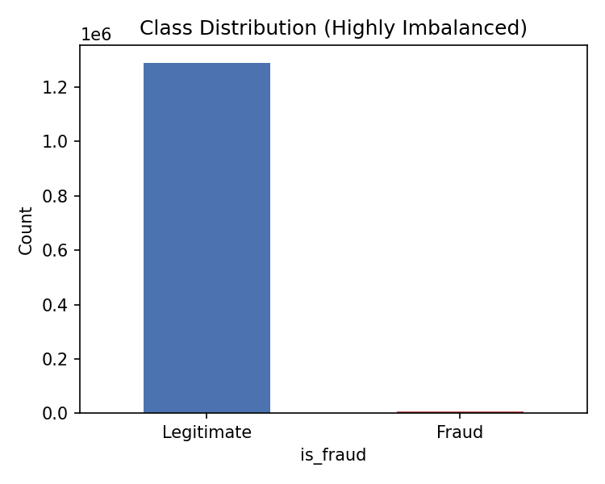
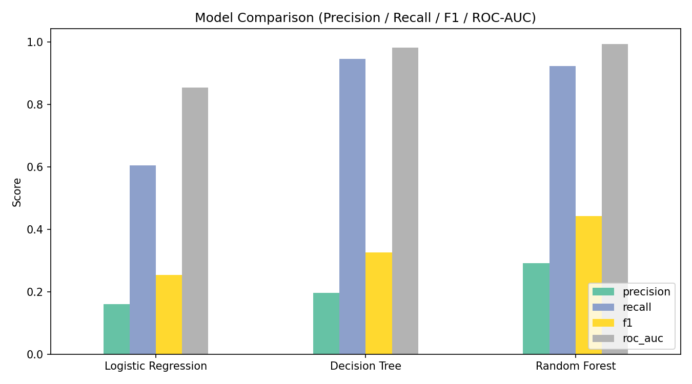
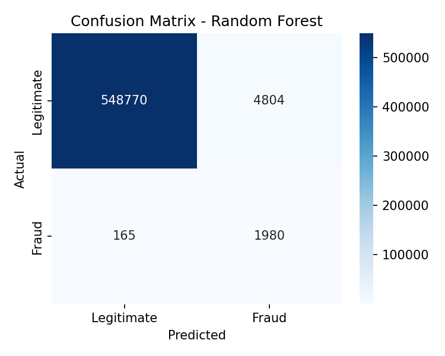
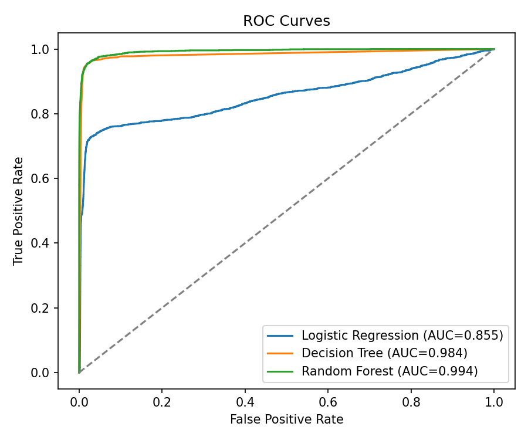

# CODSOFT_TASK2 — Credit Card Fraud Detection 💳

This repository contains my solution for **Task 2: Credit Card Fraud Detection**,
completed as part of my Machine Learning Internship at **CodSoft**.

## 📌 Task Objective
Build a machine learning model to classify credit card transactions as
**fraudulent** or **legitimate** based on transaction data.

## 📂 Dataset
[Credit Card Transactions Fraud Detection Dataset — Kaggle](https://www.kaggle.com/datasets/kartik2112/fraud-detection)

- Files used: `fraudTrain.csv` and `fraudTest.csv` (already split by the dataset)
- Test set: 555,719 transactions, of which 2,145 (~0.39%) are fraudulent (highly imbalanced)
- Target: `is_fraud` (0 = Legitimate, 1 = Fraud)

## 🛠️ Approach
1. **Feature Engineering** — created customer age (from date of birth), transaction hour / day-of-week / month,
   and distance between the customer and merchant locations.
2. **Preprocessing** — dropped identifying / high-cardinality columns, encoded categorical features
   (category, gender, state) and scaled the transaction amount.
3. **Handling Imbalance** — undersampled the legitimate class in the training set only (3 legitimate
   transactions per fraud case), keeping the test set realistic/imbalanced for honest evaluation.
4. **Model Training** — trained and compared three classifiers:
   - Logistic Regression
   - Decision Tree
   - Random Forest
5. **Evaluation** — used Precision, Recall, F1-score, and ROC-AUC instead of plain
   accuracy, since accuracy is misleading on imbalanced datasets.

## 📊 Results
| Model                | Precision | Recall | F1-score | ROC-AUC |
|-----------------------|-----------|--------|----------|---------|
| Logistic Regression   | 0.16 | 0.60 | 0.26 | 0.855 |
| Decision Tree         | 0.20 | 0.95 | 0.33 | 0.984 |
| Random Forest         | 0.29 | 0.92 | 0.44 | 0.994 |

Best model (selected by F1-score): **Random Forest**






## 🧰 Tech Stack
- Python
- Pandas, NumPy
- Scikit-learn (Logistic Regression, Decision Tree, Random Forest)
- Matplotlib, Seaborn

## 🚀 How to Run
```bash
pip install pandas numpy scikit-learn matplotlib seaborn
python credit_card_fraud_detection.py
```
Make sure `fraudTrain.csv` and `fraudTest.csv` are in the same folder as the script.

## 📁 Repository Structure
```
CODSOFT_TASK2/
│
├── credit_card_fraud_detection.py  # Main script
├── class_distribution.png          # Fraud vs Legitimate class balance
├── model_comparison.png            # Precision/Recall/F1/ROC-AUC comparison
├── confusion_matrix.png            # Confusion matrix of best model
├── roc_curves.png                  # ROC curves for all models
└── README.md                       # Project documentation
```

## 🎥 Demo
https://lnkd.in/p/d49XvvGb

## 🙌 Acknowledgements
Completed as part of the **CodSoft Machine Learning Internship**.

#codsoft #internship #machinelearning
